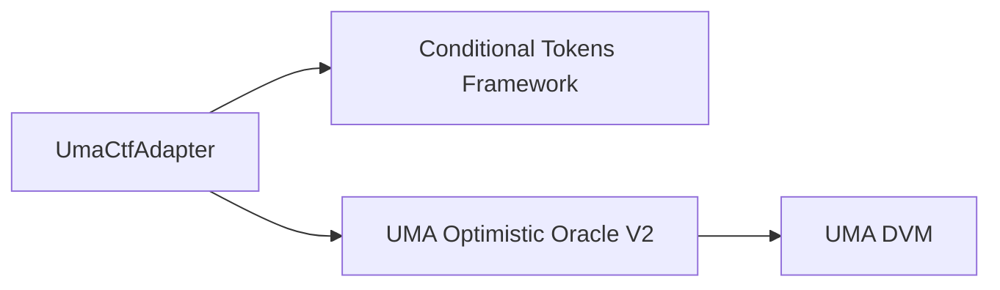

## Overview

The UMA CTF Adapter serves as an oracle bridge between the [Conditional Tokens Framework (CTF)](https://docs.gnosis.io/conditionaltokens/) and [UMA's Optimistic Oracle V2](https://docs.umaproject.org/oracle/optimistic-oracle-interface). It enables Polymarket prediction markets to be resolved using UMA's optimistic dispute resolution mechanism.

## Contract Architecture

The adapter system consists of three main components:



### Core Components

<CardGroup cols={3}>
  <Card title="UmaCtfAdapter" icon="link">
    Central contract that coordinates between CTF and UMA Oracle
  </Card>
  <Card title="CTF" icon="coins">
    Framework for creating conditional tokens representing market outcomes
  </Card>
  <Card title="Optimistic Oracle" icon="scale-balanced">
    UMA's oracle that provides optimistic dispute resolution
  </Card>
</CardGroup>

### Key Contract Elements

The `UmaCtfAdapter` contract includes:

- **Immutable References**: Direct connections to CTF and Optimistic Oracle contracts
- **Question Storage**: Mapping of `questionID` to `QuestionData` structs containing market parameters
- **Oracle Interface**: Implementation of `IOptimisticRequester` for receiving callbacks
- **Access Control**: Admin functionality via the `Auth` mixin

```solidity UmaCtfAdapter.sol
contract UmaCtfAdapter is IUmaCtfAdapter, Auth, BulletinBoard, IOptimisticRequester {
    /// @notice Conditional Tokens Framework
    IConditionalTokens public immutable ctf;

    /// @notice Optimistic Oracle
    IOptimisticOracleV2 public immutable optimisticOracle;

    /// @notice Mapping of questionID to QuestionData
    mapping(bytes32 => QuestionData) public questions;
    
    // ...
}
```

## Question Data Structure

Each market is represented by a `QuestionData` struct:

```solidity IUmaCtfAdapter.sol
struct QuestionData {
    uint256 requestTimestamp;           // OO request timestamp
    uint256 reward;                     // Proposer reward amount
    uint256 proposalBond;               // Required bond for proposals
    uint256 liveness;                   // Time before auto-settlement
    uint256 manualResolutionTimestamp;  // For flagged questions
    bool resolved;                      // Resolution status
    bool paused;                        // Paused status
    bool reset;                         // Has been reset once
    bool refund;                        // Reward refund flag
    address rewardToken;                // ERC20 for rewards/bonds
    address creator;                    // Question creator
    bytes ancillaryData;                // Resolution data
}
```

## Resolution Flow

<Steps>
  <Step title="Market Initialization">
    When a new market is created, the `initialize()` function:
    
    1. Validates the ancillary data and reward token
    2. Stores market parameters in the `questions` mapping
    3. Calls `ctf.prepareCondition()` to prepare the market on CTF
    4. Sends a price request to the Optimistic Oracle
    
    ```solidity UmaCtfAdapter.sol
    function initialize(
        bytes memory ancillaryData,
        address rewardToken,
        uint256 reward,
        uint256 proposalBond,
        uint256 liveness
    ) external returns (bytes32 questionID)
    ```
  </Step>

  <Step title="Proposal Period">
    UMA proposers monitor requests and fetch resolution data off-chain. A proposer:
    
    - Stakes the required bond
    - Proposes a price (0 for NO, 0.5 ether for UNKNOWN, 1 ether for YES)
    - Waits for the liveness period (~2 hours by default)
    
    <Note>
      The liveness period allows disputers to challenge incorrect proposals.
    </Note>
  </Step>

  <Step title="Dispute Handling (First Dispute)">
    If the proposal is disputed for the first time:
    
    - The `priceDisputed()` callback is triggered automatically
    - The adapter **resets** the question with a new timestamp
    - A fresh price request is sent to the Optimistic Oracle
    
    <Warning>
      This automatic reset ensures obviously incorrect proposals don't delay resolution.
    </Warning>
    
    ```solidity UmaCtfAdapter.sol
    function priceDisputed(bytes32, uint256, bytes memory ancillaryData, uint256) 
        external onlyOptimisticOracle {
        // ...
        if (questionData.reset) {
            questionData.refund = true;
            return;
        }
        
        // Reset the question
        _reset(address(this), questionID, false, questionData);
    }
    ```
  </Step>

  <Step title="Dispute Handling (Second Dispute)">
    If disputed again:
    
    - The dispute escalates to UMA's Data Verification Mechanism (DVM)
    - UMA token holders vote on the correct outcome
    - Resolution takes 48-72 hours
    - The `refund` flag is set to return rewards to the creator
  </Step>

  <Step title="Market Resolution">
    Once the price is available, anyone can call `resolve()`:
    
    ```solidity UmaCtfAdapter.sol
    function resolve(bytes32 questionID) external {
        // Validates the question is ready
        // Fetches price from Optimistic Oracle
        int256 price = optimisticOracle.settleAndGetPrice(...);
        
        // Constructs payout array based on price
        uint256[] memory payouts = _constructPayouts(price);
        
        // Reports payouts to CTF
        ctf.reportPayouts(questionID, payouts);
    }
    ```
    
    The adapter converts oracle prices to CTF payout arrays:
    
    | Oracle Price | Outcome | Payout Array [YES, NO] |
    |--------------|---------|------------------------|
    | 0            | NO      | [0, 1]                 |
    | 0.5 ether    | UNKNOWN | [1, 1]                 |
    | 1 ether      | YES     | [1, 0]                 |
  </Step>
</Steps>

## Safety Mechanisms

### Automatic Reset

On the first dispute, the adapter automatically resets the question:
- Prevents malicious or incorrect proposals from stalling resolution
- Ensures a second chance for proposers to provide correct data
- Only happens once per question

### Manual Resolution

Admins can flag questions for manual resolution:

```solidity UmaCtfAdapter.sol
function flag(bytes32 questionID) external onlyAdmin {
    // Flags question and sets safety period
    questionData.manualResolutionTimestamp = block.timestamp + SAFETY_PERIOD;
    questionData.paused = true;
}

function resolveManually(bytes32 questionID, uint256[] calldata payouts) 
    external onlyAdmin {
    // After safety period, admin can manually resolve
}
```

<Note>
  Manual resolution requires a 1-hour safety period to prevent hasty decisions.
</Note>

### Pause/Unpause

Admins can pause resolution to handle edge cases:

```solidity
function pause(bytes32 questionID) external onlyAdmin;
function unpause(bytes32 questionID) external onlyAdmin;
```

## Price Validation

The adapter enforces strict price validation:

```solidity UmaCtfAdapter.sol
function _constructPayouts(int256 price) internal pure returns (uint256[] memory) {
    // Valid prices: 0, 0.5 ether, or 1 ether
    if (price != 0 && price != 0.5 ether && price != 1 ether) 
        revert InvalidOOPrice();
    // ...
}
```

## Special Price: Ignore

If the oracle returns `type(int256).min` (the "ignore" price):
- The question is automatically reset
- A new price request is sent
- This allows the oracle to signal that a question needs reconsideration

## Integration Points

### Conditional Tokens Framework

The adapter interacts with CTF through two key functions:

```solidity
// Prepare a condition (during initialization)
ctf.prepareCondition(address(this), questionID, 2);

// Report payouts (during resolution)
ctf.reportPayouts(questionID, payouts);
```

### Optimistic Oracle V2

The adapter configures oracle requests with specific settings:

```solidity UmaCtfAdapter.sol
// Request price
optimisticOracle.requestPrice(
    YES_OR_NO_IDENTIFIER,    // "YES_OR_NO_QUERY"
    requestTimestamp, 
    ancillaryData, 
    IERC20(rewardToken), 
    reward
);

// Set as event-based
optimisticOracle.setEventBased(...);

// Enable dispute callback
optimisticOracle.setCallbacks(
    ...,
    false,  // No callback on proposal
    true,   // Callback on dispute
    false   // No callback on settlement
);
```

## Constants

```solidity UmaCtfAdapter.sol
/// @notice Time period for manual resolution safety
uint256 public constant SAFETY_PERIOD = 1 hours;

/// @notice Query identifier for Optimistic Oracle (from UMIP-107)
bytes32 public constant YES_OR_NO_IDENTIFIER = "YES_OR_NO_QUERY";

/// @notice Maximum ancillary data length
uint256 public constant MAX_ANCILLARY_DATA = 8139;
```

## Security Considerations

<Warning>
  - **Reward Token Must Be Whitelisted**: Only UMA-approved collateral tokens can be used
  - **Proposal Bond Sizing**: Set bonds appropriately based on market value at risk
  - **Liveness Period**: Longer periods provide more security for high-value markets
  - **Admin Keys**: Admin functions should be controlled by a multisig or governance system
</Warning>

## Audits

The UMA CTF Adapter has been audited by OpenZeppelin. See the [audit report](https://github.com/Polymarket/uma-ctf-adapter/blob/main/audit/Polymarket_UMA_Optimistic_Oracle_Adapter_Audit.pdf) for details.
