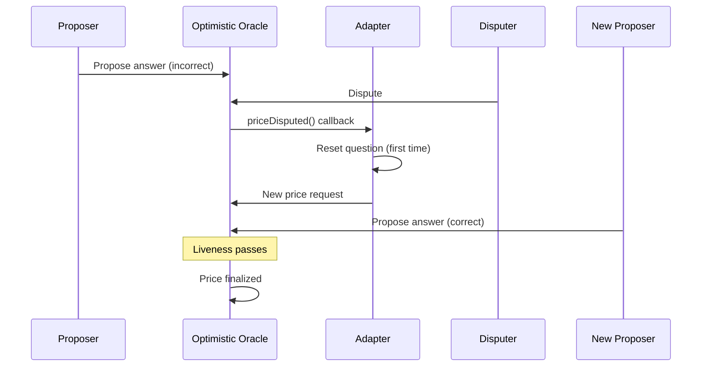
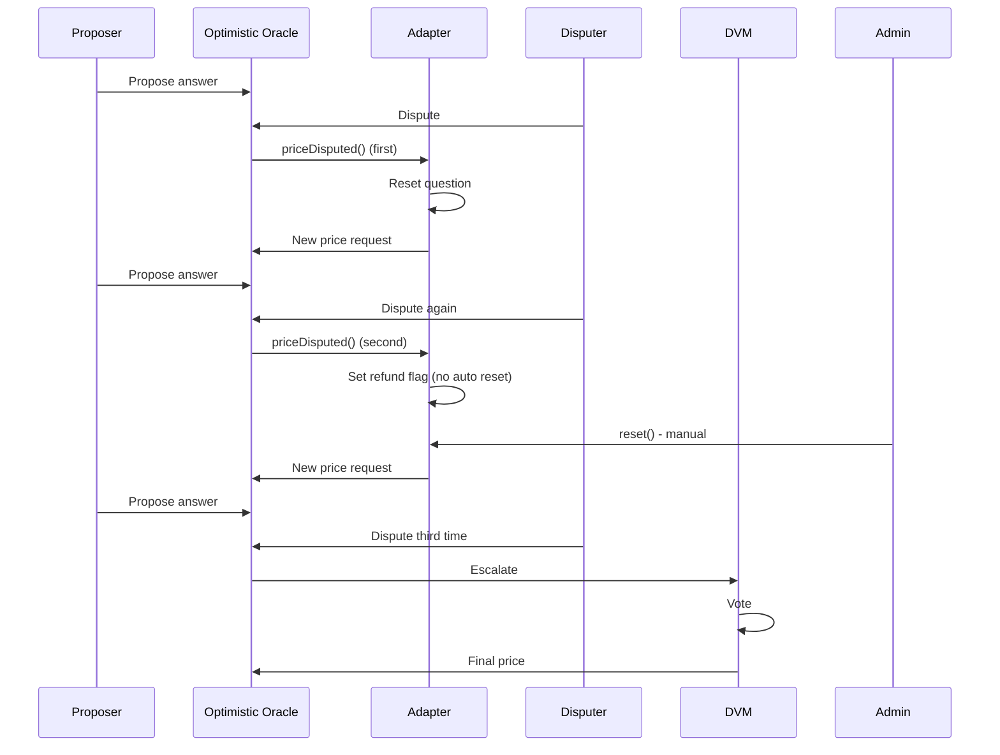

## Overview

UMA's Optimistic Oracle allows anyone to dispute incorrect proposals during the liveness period. When a dispute occurs, the adapter automatically handles the reset process and, if necessary, escalates to UMA's Data Verification Mechanism (DVM) for final resolution.

## Dispute Flow

<Steps>
  <Step title="Initial Proposal">
    A proposer submits an answer (0, 0.5, or 1) and posts a bond
  </Step>
  
  <Step title="Liveness Period">
    The proposal enters a challenge period (default: 2 hours, or custom liveness)
  </Step>
  
  <Step title="Dispute Submitted">
    A disputer disagrees with the proposal and posts a dispute bond
  </Step>
  
  <Step title="Adapter Callback">
    The Optimistic Oracle calls `priceDisputed()` on the adapter
  </Step>
  
  <Step title="Automatic Reset">
    The adapter resets the question and creates a new price request
  </Step>
  
  <Step title="DVM Resolution">
    UMA token holders vote on the correct answer (if dispute reaches DVM)
  </Step>
</Steps>

## The priceDisputed() Callback

### Function Signature

```solidity UmaCtfAdapter.sol
function priceDisputed(
    bytes32,
    uint256,
    bytes memory ancillaryData,
    uint256
) external onlyOptimisticOracle
```

<Info>
  **Automatic Invocation:** This function is automatically called by the Optimistic Oracle when a dispute occurs. You never call this directly.
</Info>

### Callback Behavior

When a price is disputed, the adapter's response depends on the question's current state:

<AccordionGroup>
  <Accordion title="Already Resolved">
    If the question was already resolved (e.g., via `resolveManually()`), the callback:
    
    - Does **not** modify any storage
    - Refunds the reward to the question creator
    - Returns early
    
    ```solidity Source: UmaCtfAdapter.sol:170-173
    if (questionData.resolved) {
        TransferHelper._transfer(questionData.rewardToken, questionData.creator, questionData.reward);
        return;
    }
    ```
  </Accordion>
  
  <Accordion title="Already Reset Once">
    If the question was already reset from a previous dispute:
    
    - Sets the `refund` flag to `true`
    - Does **not** reset again (maximum one automatic reset)
    - Reward will be refunded on eventual resolution
    
    ```solidity Source: UmaCtfAdapter.sol:175-178
    if (questionData.reset) {
        questionData.refund = true;
        return;
    }
    ```
    
    <Warning>
      After the second dispute, the question can only be reset manually by an admin using `reset()`
    </Warning>
  </Accordion>
  
  <Accordion title="First Dispute">
    If this is the first dispute:
    
    - Calls `_reset()` to create a new price request
    - Sets `reset` flag to `true`
    - Updates `requestTimestamp` to current time
    - Reuses original reward/bond/liveness parameters
    
    ```solidity Source: UmaCtfAdapter.sol:182
    _reset(address(this), questionID, false, questionData);
    ```
  </Accordion>
</AccordionGroup>

## Reset Mechanism

### Automatic Reset

When a question is reset (during first dispute), the adapter:

1. **Updates the request timestamp** to `block.timestamp`
2. **Sets the `reset` flag** to `true` (prevents multiple automatic resets)
3. **Submits a new price request** to the Optimistic Oracle with:
   - Same ancillary data
   - Same reward/bond/liveness parameters
   - New timestamp for tracking

```solidity Source: UmaCtfAdapter.sol:390-410
function _reset(
    address requestor,
    bytes32 questionID,
    bool resetRefund,
    QuestionData storage questionData
) internal {
    uint256 requestTimestamp = block.timestamp;
    
    // Update the question parameters in storage
    questionData.requestTimestamp = requestTimestamp;
    questionData.reset = true;
    if (resetRefund) questionData.refund = false;

    // Send out a new price request with the new timestamp
    _requestPrice(
        requestor,
        requestTimestamp,
        questionData.ancillaryData,
        questionData.rewardToken,
        questionData.reward,
        questionData.proposalBond,
        questionData.liveness
    );

    emit QuestionReset(questionID);
}
```

### Who Pays for Reset?

<CardGroup cols={2}>
  <Card title="First Dispute (Automatic)" icon="rotate">
    **Payer:** The adapter itself
    
    The reward is reused from the original request that's now sitting in the adapter contract
  </Card>
  
  <Card title="Manual Reset (Admin)" icon="user-shield">
    **Payer:** The admin calling `reset()`
    
    Admin must approve token spending for the reward amount
  </Card>
</CardGroup>

### Manual Reset (Admin Only)

Admins can manually reset a question using the `reset()` function:

```solidity UmaCtfAdapter.sol
function reset(bytes32 questionID) external onlyAdmin
```

<ParamField path="questionID" type="bytes32" required>
  The unique identifier of the question to reset
</ParamField>

**When to use manual reset:**
- Question has been disputed multiple times (second+ dispute)
- The `priceDisputed` callback failed due to an edge case
- Admin intervention is needed to unstick a market

**Requirements:**
- Caller must be an admin
- Question must be initialized
- Question must not be resolved
- Admin must have approved adapter to spend `reward` amount of `rewardToken`

```solidity Manual Reset Example
address adapter = 0x...;
bytes32 questionID = 0x...;
address rewardToken = 0x...; // e.g., USDC

QuestionData memory data = IUmaCtfAdapter(adapter).getQuestion(questionID);

// Approve spending for the reward
IERC20(rewardToken).approve(adapter, data.reward);

// Reset the question
IUmaCtfAdapter(adapter).reset(questionID);
```

<Info>
  **Refund Handling:** If the `refund` flag is set (from a previous dispute), `reset()` will first refund the reward to the original creator before creating the new price request.
</Info>

## DVM Escalation

When a dispute cannot be resolved through the Optimistic Oracle (e.g., after multiple disputes or when proposer/disputer disagree), the question escalates to UMA's Data Verification Mechanism (DVM).

### What is the DVM?

<Card title="Data Verification Mechanism" icon="users">
  The DVM is UMA's decentralized oracle system where UMA token holders vote on disputed outcomes.
  
  - **Voting Period:** 48-96 hours typically
  - **Incentive:** Voters earn rewards for voting with the majority
  - **Final Authority:** DVM decision is final and binding
</Card>

### DVM Resolution Process

<Steps>
  <Step title="Dispute Escalates">
    After a dispute bond is posted, the Optimistic Oracle escalates to DVM
  </Step>
  
  <Step title="Commit Phase">
    UMA token holders commit encrypted votes
  </Step>
  
  <Step title="Reveal Phase">
    Voters reveal their encrypted votes
  </Step>
  
  <Step title="Resolution">
    Votes are tallied, majority wins, and the price is set
  </Step>
  
  <Step title="Price Available">
    The adapter can now call `resolve()` to finalize the market
  </Step>
</Steps>

### Monitoring DVM Progress

You can check if a question is awaiting DVM resolution:

```solidity Check DVM Status
bytes32 questionID = 0x...;

// Check if market is ready
bool isReady = adapter.ready(questionID);

if (!isReady) {
    QuestionData memory data = adapter.getQuestion(questionID);
    
    // Check if price is available from OO
    bool hasPrice = optimisticOracle.hasPrice(
        address(adapter),
        adapter.YES_OR_NO_IDENTIFIER(),
        data.requestTimestamp,
        data.ancillaryData
    );
    
    if (!hasPrice) {
        // Either:
        // 1. Still in liveness period
        // 2. Disputed and awaiting DVM
        // 3. No proposal yet
    }
}
```

### DVM Vote Outcomes

The DVM can return any of the standard prices:

- **0** = NO
- **0.5 ether** = UNKNOWN (50/50 split)
- **1 ether** = YES
- **type(int256).min** = IGNORE (question should be reset)

<Warning>
  If the DVM returns the IGNORE price, the adapter will automatically reset the question when `resolve()` is called, creating a new price request.
</Warning>

## Dispute Scenarios

### Scenario 1: Single Dispute, Quick Resolution



**Timeline:**
- T0: Initial proposal
- T0 + 1 hour: Dispute submitted
- T0 + 1 hour: Question reset automatically
- T0 + 2 hours: New proposal submitted
- T0 + 2 hours + liveness: Market ready to resolve

### Scenario 2: Multiple Disputes, DVM Escalation



**Timeline:**
- T0: Initial proposal + first dispute → automatic reset
- T1: Second proposal + dispute → refund flag set, no auto reset
- T2: Admin manually resets
- T3: Third proposal + dispute → DVM escalation
- T3 + 48-96 hours: DVM vote completes
- T3 + 96 hours: Market ready to resolve

### Scenario 3: Dispute After Manual Resolution

```solidity
// Market is flagged and manually resolved by admin
adapter.flag(questionID);
// ... safety period passes ...
adapter.resolveManually(questionID, [1, 0]);

// Meanwhile, a dispute occurs on the original OO request
// The priceDisputed callback fires but does nothing except refund
// The manual resolution stands
```

<Info>
  Once a market is manually resolved, disputes on the underlying OO request have no effect except triggering a refund to the creator.
</Info>

## Admin Intervention Tools

### Flagging for Manual Resolution

Admins can flag problematic markets for manual intervention:

```solidity UmaCtfAdapter.sol
function flag(bytes32 questionID) external onlyAdmin
```

**Effects:**
- Pauses the market (prevents resolution)
- Sets `manualResolutionTimestamp` to `block.timestamp + 1 hour` (safety period)
- Emits `QuestionFlagged` event

**When to flag:**
- Question is ambiguous or invalid
- Oracle manipulation suspected
- Need time to investigate before resolution

### Manual Resolution

After flagging and waiting for the safety period, admins can manually resolve:

```solidity UmaCtfAdapter.sol
function resolveManually(
    bytes32 questionID,
    uint256[] calldata payouts
) external onlyAdmin
```

<ParamField path="questionID" type="bytes32" required>
  The unique identifier of the question
</ParamField>

<ParamField path="payouts" type="uint256[]" required>
  The payout array to report. Must be a valid payout: `[0,1]`, `[1,0]`, or `[1,1]`
</ParamField>

**Requirements:**
- Question must be flagged
- Safety period must have passed (`block.timestamp >= manualResolutionTimestamp`)
- Payouts must be valid

```solidity Manual Resolution Example
address adapter = 0x...;
bytes32 questionID = 0x...;

// Step 1: Flag the market
adapter.flag(questionID);

// Step 2: Wait for safety period (1 hour)
// ... time passes ...

// Step 3: Manually resolve with chosen outcome
uint256[] memory payouts = new uint256[](2);
payouts[0] = 1; // YES wins
payouts[1] = 0; // NO loses

adapter.resolveManually(questionID, payouts);
```

<Warning>
  **Use with Caution:** Manual resolution bypasses the oracle mechanism. Only use when absolutely necessary and with clear justification.
</Warning>

### Pausing Markets

Admins can temporarily pause market resolution:

```solidity UmaCtfAdapter.sol
function pause(bytes32 questionID) external onlyAdmin
```

**Effects:**
- Sets `paused` flag to `true`
- Prevents `resolve()` from being called
- Prevents `ready()` from returning `true`

**Use cases:**
- Temporary hold while investigating
- Coordinating with UMA team on resolution
- Waiting for additional information

**Unpause:**
```solidity
adapter.unpause(questionID);
```

## Error Handling

### Dispute-Related Errors

<ResponseField name="NotInitialized" type="error">
  Attempting to reset a question that doesn't exist
</ResponseField>

<ResponseField name="Resolved" type="error">
  Attempting to reset a question that's already resolved
</ResponseField>

<ResponseField name="NotOptimisticOracle" type="error">
  `priceDisputed()` was called by an address other than the Optimistic Oracle
  
  This should never happen in normal operation
</ResponseField>

## Events to Monitor

```solidity Dispute Events
// Emitted when priceDisputed callback fires and resets the question
event QuestionReset(bytes32 indexed questionID);

// Emitted when admin flags a market
event QuestionFlagged(bytes32 indexed questionID);

// Emitted when admin unflags a market
event QuestionUnflagged(bytes32 indexed questionID);

// Emitted when admin manually resolves
event QuestionManuallyResolved(
    bytes32 indexed questionID,
    uint256[] payouts
);

// Emitted when admin pauses
event QuestionPaused(bytes32 indexed questionID);

// Emitted when admin unpauses
event QuestionUnpaused(bytes32 indexed questionID);
```

## Best Practices

<CardGroup cols={2}>
  <Card title="Monitor Reset Events" icon="rotate">
    Listen for `QuestionReset` events to detect disputes and track market lifecycle
  </Card>
  
  <Card title="Plan for Delays" icon="clock">
    DVM resolution can take 48-96 hours. Build this into your UX
  </Card>
  
  <Card title="Higher Bonds = Fewer Disputes" icon="shield">
    Size bonds appropriately to deter frivolous disputes
  </Card>
  
  <Card title="Document Manual Resolutions" icon="file-lines">
    Keep records when using admin powers for transparency
  </Card>
</CardGroup>

## Dispute Economics

### Dispute Bond Mechanics

<Tabs>
  <Tab title="Proposer">
    **Initial Bond:** `proposalBond` (set in `initialize()`)
    
    **If Correct:**
    - Keeps bond
    - Receives reward
    - Receives disputer's bond
    
    **If Incorrect (disputed):**
    - Loses bond to disputer
  </Tab>
  
  <Tab title="Disputer">
    **Dispute Bond:** Equal to proposer's bond
    
    **If Correct:**
    - Keeps bond  
    - Receives proposer's bond
    
    **If Incorrect:**
    - Loses bond to proposer
  </Tab>
  
  <Tab title="DVM Voters">
    **Requirement:** Must stake UMA tokens
    
    **Rewards:**
    - Share of losing side's bonds
    - Voting rewards from UMA protocol
    
    **Penalty:**
    - None for voting with minority (just no rewards)
  </Tab>
</Tabs>

### Incentive Alignment

The dispute mechanism is designed to economically incentivize honest behavior:

1. **Proposers** want to propose correctly to earn rewards and avoid losing bonds
2. **Disputers** want to challenge only incorrect proposals to earn the proposer's bond
3. **DVM Voters** want to vote honestly to earn rewards

<Info>
  The higher the `proposalBond`, the more costly it is to propose incorrectly, and the more lucrative it is to dispute incorrect proposals.
</Info>

## Related Functions

<CardGroup cols={3}>
  <Card title="getQuestion()" icon="magnifying-glass">
    ```solidity
    function getQuestion(bytes32 questionID) 
        external 
        view 
        returns (QuestionData memory)
    ```
    
    Query full question state including `reset` and `refund` flags
  </Card>
  
  <Card title="isInitialized()" icon="check">
    ```solidity
    function isInitialized(bytes32 questionID) 
        public 
        view 
        returns (bool)
    ```
    
    Check if a question exists
  </Card>
  
  <Card title="isFlagged()" icon="flag">
    ```solidity
    function isFlagged(bytes32 questionID) 
        public 
        view 
        returns (bool)
    ```
    
    Check if a question is flagged for manual resolution
  </Card>
</CardGroup>

## Summary

The UMA CTF Adapter's dispute handling provides:

- **Automatic reset** on first dispute
- **Manual intervention** tools for admins
- **DVM escalation** for final resolution
- **Economic incentives** to ensure honest participation
- **Flexibility** to handle edge cases

By understanding the dispute flow, you can build robust market integrations that handle disputes gracefully and provide clear UX to your users during dispute resolution periods.