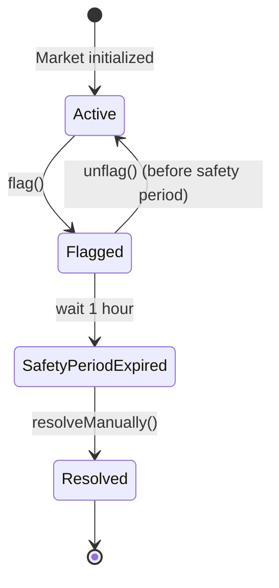

## Overview

Manual resolution provides a governance failsafe for resolving markets when the Optimistic Oracle cannot or should not be used. This mechanism includes a mandatory safety period to prevent hasty administrative actions.

## When to Use Manual Resolution

Manual resolution should be considered in these scenarios:

1. **Oracle Failure**: The Optimistic Oracle malfunctions or becomes unavailable
2. **Incorrect Oracle Price**: A clearly wrong price settles despite the dispute mechanism
3. **Market Emergency**: Critical issues require immediate intervention
4. **Governance Decision**: Community votes to override the oracle result
5. **Multiple Disputes**: After repeated disputes, automated resolution is failing
6. **Ancillary Data Issues**: Question was improperly formatted or ambiguous

## The Manual Resolution Process

### Step 1: Flag the Market

An admin must first flag the market for manual resolution:

```solidity
function flag(bytes32 questionID) external onlyAdmin
```

**Requirements** (`UmaCtfAdapter.sol:209-218`):
- Question must be initialized
- Question must **not** already be flagged
- Question must **not** be resolved

**What happens**:
```solidity
questionData.manualResolutionTimestamp = block.timestamp + SAFETY_PERIOD;
questionData.paused = true;
```

1. Sets `manualResolutionTimestamp` to current time + 1 hour (`SAFETY_PERIOD`)
2. Automatically pauses the market (`paused = true`)
3. Emits `QuestionFlagged` event

**Effects**:
- Market cannot be resolved via `resolve()` (will revert with `Paused`)
- Market is "locked" for the safety period
- Manual resolution becomes possible after the safety period expires

### Step 2: Wait for Safety Period

**Safety Period Duration**: `1 hour` (defined as `SAFETY_PERIOD` constant at line 38)

**Purpose**: 
- Prevents immediate manual resolution
- Provides time for community review and discussion
- Allows for unflagging if the flag was applied in error
- Reduces risk of hasty or malicious admin actions

**During the Safety Period**:
- Market remains paused
- No automatic resolution possible
- Admin can still **unflag** the market (reverting the flag)
- Users can review the situation and prepare for manual resolution

### Step 3: Manual Resolution

After the safety period expires, an admin can manually resolve the market:

```solidity
function resolveManually(
    bytes32 questionID, 
    uint256[] calldata payouts
) external onlyAdmin
```

**Requirements** (`UmaCtfAdapter.sol:256-262`):
- Payouts must be a valid payout array
- Question must be initialized
- Question must be **flagged** (`manualResolutionTimestamp > 0`)
- Current time must be **after** `manualResolutionTimestamp`

**Process**:
1. **Validate payouts**: Checks `_isValidPayoutArray(payouts)` at line 259
2. **Mark as resolved**: Sets `questionData.resolved = true`
3. **Handle refunds**: If `refund == true`, returns reward to creator
4. **Report payouts**: Calls `ctf.reportPayouts(questionID, payouts)` to finalize on CTF
5. **Emit event**: Emits `QuestionManuallyResolved(questionID, payouts)`

**Important**: Once resolved, the market is **immutable** - it cannot be unflagged, reset, or re-resolved.

## Payout Array Validation

The `payouts` parameter must follow specific rules:

**Binary Market Payouts** (2 outcomes):
- Array length must be exactly 2
- Valid patterns:
  - `[1, 0]` - YES outcome (first position pays out)
  - `[0, 1]` - NO outcome (second position pays out)
  - `[1, 1]` - TIE/UNKNOWN (both positions pay out 50/50)

**Note**: When using with `NegRiskOperator`, tie `[1, 1]` is **not** a valid outcome.

Validation is performed by `PayoutHelperLib.isValidPayoutArray()` - see line 487.

## Unflagging (Reverting a Flag)

If a market was flagged in error, it can be unflagged **before** the safety period expires:

```solidity
function unflag(bytes32 questionID) external onlyAdmin
```

**Requirements** (`UmaCtfAdapter.sol:224-230`):
- Question must be initialized
- Question must be **flagged** (`manualResolutionTimestamp > 0`)
- Question must **not** be resolved
- Current time must be **before** `manualResolutionTimestamp` (safety period not passed)

**What happens**:
```solidity
questionData.manualResolutionTimestamp = 0;
questionData.paused = false;
```

1. Clears `manualResolutionTimestamp` (sets to 0)
2. Unpauses the market (`paused = false`)
3. Emits `QuestionUnflagged` event

**Result**: Market returns to normal operation and can be resolved via the Optimistic Oracle.

**Important**: Unflagging is **only** possible during the safety period. After the safety period expires, the market must be resolved manually - it cannot be unflagged.

## Safety Period Mechanics

### Constant Definition

```solidity
uint256 public constant SAFETY_PERIOD = 1 hours;
```

Defined at `UmaCtfAdapter.sol:38`. This is a constant and **cannot be changed** after deployment.

### Timestamp Calculation

When a market is flagged:
```solidity
questionData.manualResolutionTimestamp = block.timestamp + SAFETY_PERIOD;
```

**Example**:
- Market flagged at: `1646064000` (Unix timestamp)
- Safety period: `3600` seconds (1 hour)
- Manual resolution allowed at: `1646067600`

### Enforcement

**Before safety period** (`unflag` allowed):
```solidity
if (block.timestamp > questionData.manualResolutionTimestamp) revert SafetyPeriodPassed();
```

**After safety period** (`resolveManually` allowed):
```solidity
if (block.timestamp < questionData.manualResolutionTimestamp) revert SafetyPeriodNotPassed();
```

## State Transitions



## Events

### QuestionFlagged
```solidity
event QuestionFlagged(bytes32 indexed questionID);
```
Emitted when a market is flagged for manual resolution.

### QuestionUnflagged
```solidity
event QuestionUnflagged(bytes32 indexed questionID);
```
Emitted when a flag is removed during the safety period.

### QuestionManuallyResolved
```solidity
event QuestionManuallyResolved(bytes32 indexed questionID, uint256[] payouts);
```
Emitted when manual resolution completes. Includes the final payout array.

## Example: Complete Manual Resolution Flow

### Scenario
A market has an obviously incorrect oracle price that settled. The community wants manual resolution.

### Steps

1. **Flag the market** (timestamp: T+0)
   ```solidity
   adapter.flag(questionID);
   ```
   - Market is paused immediately
   - `manualResolutionTimestamp` set to T+1h
   - `QuestionFlagged` event emitted

2. **Community review** (T+0 to T+1h)
   - Governance discusses correct outcome
   - If error detected, admin can `unflag()` before T+1h
   - Prepare correct payout array

3. **Safety period expires** (T+1h)
   - `unflag()` no longer possible
   - `resolveManually()` becomes available

4. **Manual resolution** (T+1h or later)
   ```solidity
   uint256[] memory payouts = new uint256[](2);
   payouts[0] = 1;  // YES outcome
   payouts[1] = 0;
   adapter.resolveManually(questionID, payouts);
   ```
   - Market is marked `resolved = true`
   - Payouts reported to CTF
   - `QuestionManuallyResolved` event emitted
   - Users can now redeem positions

## Best Practices

1. **Document the reason**: Always document why manual resolution is needed
2. **Community consensus**: Seek community input during the safety period
3. **Verify payouts**: Triple-check the payout array before calling `resolveManually()`
4. **Monitor refunds**: Check if `refund == true` to ensure creators get rewards back
5. **Use unflag judiciously**: If you flag by mistake, unflag immediately (within 1 hour)
6. **Consider the safety period**: Plan for the 1-hour delay in time-sensitive situations
7. **Emit reasoning**: Consider posting reasoning on-chain or to IPFS for transparency

## Security Considerations

### Admin Trust
Manual resolution requires trusted admins. Ensure:
- Multi-sig or governance-controlled admin keys
- Clear admin action policies and procedures
- Public logging of all manual resolutions

### Safety Period Protection
The 1-hour delay protects against:
- Hasty decisions
- Single-point-of-failure admin compromise
- Fat-finger errors

### Irreversibility
Once `resolveManually()` is called:
- Market is permanently resolved
- No way to reverse or correct errors
- Payouts are immediately final on the CTF

**Mitigation**: Take time during the safety period to verify the correct outcome.

## Code References

- **flag()**: `UmaCtfAdapter.sol:209`
- **unflag()**: `UmaCtfAdapter.sol:224`
- **resolveManually()**: `UmaCtfAdapter.sol:256`
- **SAFETY_PERIOD constant**: `UmaCtfAdapter.sol:38`
- **_isFlagged()**: `UmaCtfAdapter.sol:451`
- **Payout validation**: `UmaCtfAdapter.sol:486`
