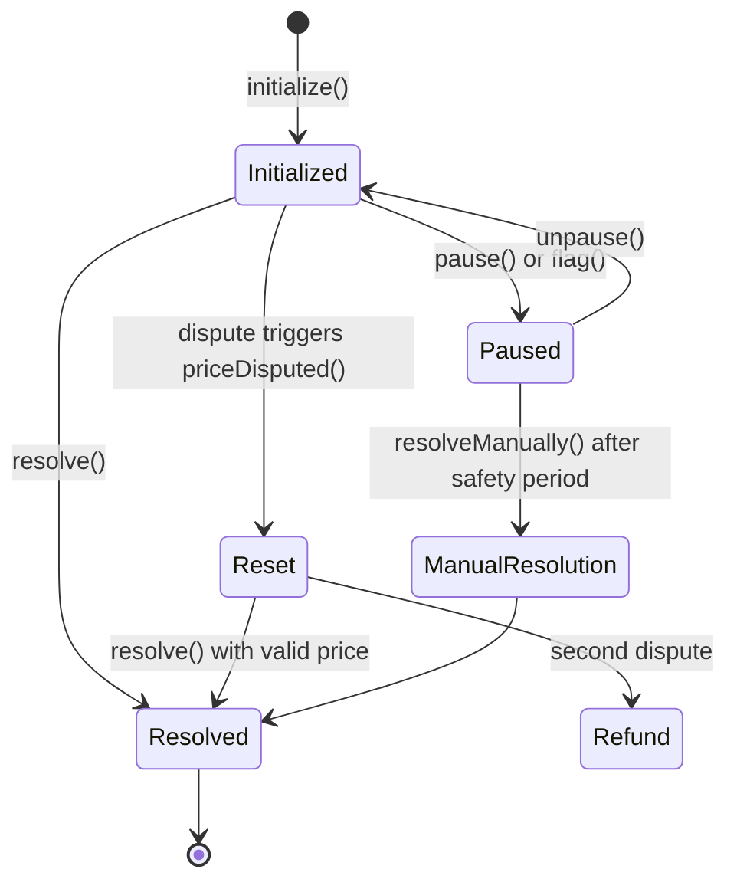

## Overview

A market in the UMA CTF Adapter progresses through various states from initialization to resolution. Understanding these states is crucial for proper market management and integration.

## State Flags

The `QuestionData` struct tracks market state through several boolean flags:

### Initialized

**Indicator**: `ancillaryData.length > 0`

A market is considered initialized when it has been created via the `initialize()` function. This:
- Creates a unique `questionID` from the ancillary data
- Prepares the condition on the Conditional Tokens Framework
- Submits a price request to UMA's Optimistic Oracle
- Stores all question parameters in the contract

**Check**: Use `isInitialized(questionID)` to verify initialization status.

### Paused

**Flag**: `paused`

A paused market cannot be resolved. Markets can be paused in two ways:

1. **Admin pause**: Explicitly paused by an admin via `pause(questionID)`
2. **Flagged for manual resolution**: Automatically paused when `flag(questionID)` is called

**Effects**:
- `resolve()` will revert with `Paused` error
- `ready()` returns `false`
- `getExpectedPayouts()` will revert with `Paused` error

**Recovery**: Admin calls `unpause(questionID)` or `unflag(questionID)` (if flagged)

### Flagged

**Indicator**: `manualResolutionTimestamp > 0`

A market flagged for manual resolution indicates intervention is needed. This state:
- Sets `paused = true` automatically
- Sets `manualResolutionTimestamp = block.timestamp + SAFETY_PERIOD` (1 hour)
- Blocks automatic resolution via UMA Oracle
- Enables manual resolution after the safety period

**Use cases**:
- Oracle malfunction or incorrect price
- Disputed outcome requiring governance decision
- Emergency intervention needed

**Check**: Use `isFlagged(questionID)` to verify flagged status.

### Resolved

**Flag**: `resolved`

A resolved market has finalized payouts reported to the CTF. Resolution can happen two ways:

1. **Automatic resolution**: Via `resolve()` after Oracle settles the price
2. **Manual resolution**: Via `resolveManually()` by an admin after safety period

Once resolved:
- Market is immutable - cannot be reset or re-resolved
- Payouts are fixed on the Conditional Tokens Framework
- Users can redeem positions based on the reported payouts

### Reset

**Flag**: `reset`

Indicates the question has been reset after a dispute. This happens when:
- A price proposal is disputed on the Optimistic Oracle
- The `priceDisputed()` callback is triggered
- A new price request is submitted with updated `requestTimestamp`

**Important**: A question can only be reset **once** automatically via dispute. Further resets require admin intervention via `reset()`.

### Refund

**Flag**: `refund`

Marks that the reward should be refunded to the question creator. Set when:
- A second dispute occurs on an already-reset question
- The reward needs to be returned on resolution or manual resolution

## State Transitions

## State Validation Matrix

| State | Can Resolve? | Can Reset? | Can Flag? | Can Pause? |
|-------|-------------|-----------|----------|------------|
| **Initialized** | Yes (if price available) | Yes (admin) | Yes | Yes |
| **Paused** | No | Yes (admin) | Yes (if not flagged) | Already paused |
| **Flagged** | No (use manual) | Yes (admin) | Already flagged | Already paused |
| **Resolved** | No | No | No | No |
| **Reset** | Yes (new price) | Yes (admin) | Yes | Yes |

## Code References

Key state check functions:

- **Initialization**: `_isInitialized()` at `UmaCtfAdapter.sol:455`
- **Flagged**: `_isFlagged()` at `UmaCtfAdapter.sol:451`
- **Ready**: `_ready()` at `UmaCtfAdapter.sol:299` - checks all conditions for resolution
- **Has Price**: `_hasPrice()` at `UmaCtfAdapter.sol:441` - queries Optimistic Oracle

## Best Practices

1. **Always check initialization** before performing operations on a questionID
2. **Monitor the `reset` flag** to track if a market has been disputed
3. **Check `ready()` status** before attempting resolution
4. **Track `paused` and `flagged` states** separately - flagged implies paused, but paused doesn't imply flagged
5. **Verify `resolved` state** before attempting any state changes
